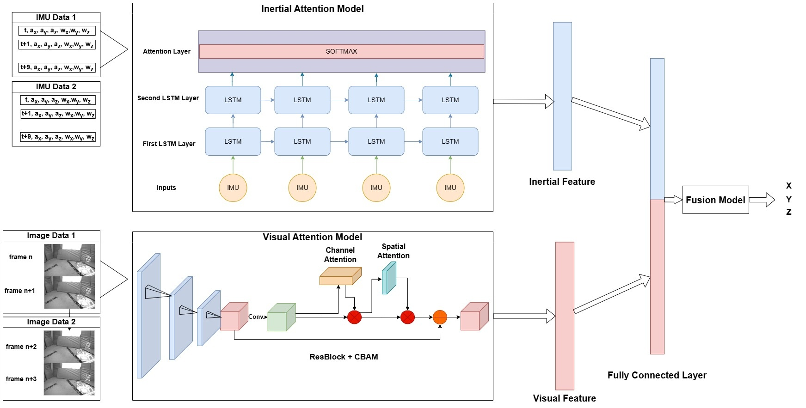

# DAVIS: A Deep Attention-Based Visual–Inertial Positioning System for UAVs



DAVIS is a deep learning-based visual–inertial positioning framework developed for direct absolute 3D position estimation of unmanned aerial vehicles (UAVs) in GNSS-denied environments.

The framework combines visual information from consecutive grayscale image pairs with short synchronized IMU sequences. A ResNet50 backbone enhanced with the Convolutional Block Attention Module (CBAM) is used for visual feature extraction, while an Attention-Based Hierarchical Long Short-Term Memory (AHLSTM) network processes the inertial measurements. The resulting feature representations are fused through a fully connected regression network to estimate the UAV position.

## Main Components

- **Visual branch:** ImageNet-pretrained ResNet50 + CBAM
- **Inertial branch:** AHLSTM
- **Fusion:** Feature-level concatenation followed by fully connected regression
- **Output:** Absolute 3D UAV position
- **Dataset:** EuRoC MAV
- **Visual input:** Two non-overlapping consecutive grayscale frames resized to 120 × 188
- **Inertial input:** 10 × 6 IMU sequence containing tri-axial acceleration and angular velocity

## Input Construction

The EuRoC MAV camera operates at 20 Hz and the IMU at 200 Hz. DAVIS forms non-overlapping visual samples as:

`(I0, I1), (I2, I3), (I4, I5), ...`

Each image pair is associated with the corresponding 10 IMU measurements. The target is the absolute 3D position corresponding to the second image of the pair.

## Repository Structure

```text
DAVIS-UAV-Positioning/
├── images/
│   └── tez-main-model-en.jpg
├── src/
│   ├── train_davis.py
│   ├── davis_complete.py
│   └── ablation_A1_A8.py
├── data/
│   └── README.md
├── requirements.txt
├── .gitignore
└── README.md
```

## Code

### `src/train_davis.py`

Main training and evaluation script for the complete DAVIS configuration using non-overlapping visual–inertial samples.

### `src/davis_complete.py`

Complete DAVIS implementation retained as a separate research script.

### `src/ablation_A1_A8.py`

Ablation implementation used to evaluate the eight configurations reported in the study:

| Configuration | Visual Branch | Inertial Branch | Setting |
|---|---|---|---|
| A1 | ResNet50 | LSTM | Visual–inertial fusion |
| A2 | ResNet50 + CBAM | LSTM | Visual–inertial fusion |
| A3 | ResNet50 | AHLSTM | Visual–inertial fusion |
| A4 | ResNet50 + CBAM | AHLSTM | Complete DAVIS |
| A5 | ResNet50 | — | Visual only |
| A6 | ResNet50 + CBAM | — | Visual only |
| A7 | — | LSTM | Inertial only |
| A8 | — | AHLSTM | Inertial only |

## Installation

Create a Python environment and install the required packages:

```bash
pip install -r requirements.txt
```

## Dataset

The experiments use the following EuRoC MAV sequences:

- V1-01
- V1-02
- V1-03
- V2-01
- V2-02
- V2-03

The EuRoC MAV dataset is not included in this repository. Download it from the official dataset source and update the dataset path in the Python scripts before training.

A typical local organization can be:

```text
data/
├── V1_01_easy/
├── V1_02_medium/
├── V1_03_difficult/
├── V2_01_easy/
├── V2_02_medium/
└── V2_03_difficult/
```

## Running DAVIS

After updating `dataset_main_file_path` in the script:

```bash
python src/train_davis.py
```

To run the A1–A8 ablation experiments:

```bash
python src/ablation_A1_A8.py
```

## Reported Results

In the current study:

- The complete DAVIS configuration (A4) achieved a mean RMSE of **0.094 m** across six EuRoC MAV sequences.
- The ResNet50 + AHLSTM configuration (A3) achieved the lowest mean RMSE in the ablation study with **0.092 m**.
- The complete DAVIS model achieved an average inference time of **5.16 ms/sample** on an NVIDIA RTX A2000 GPU using FP32 precision and batch size 1.

The current evaluation is based primarily on sequence-specific training and testing. Cross-sequence and cross-environment generalization are not claimed by the present experiments.

## Reproducibility

The repository contains the research scripts corresponding to the model architecture and ablation configurations used in the study. Dataset paths may need to be adjusted according to the local EuRoC installation.

Additional reproducibility material, trained weights, fixed data splits, and publication metadata can be added after the final manuscript version is completed.

## Citation

Citation information will be added after publication.

## Acknowledgement

The computational experiments were carried out using GPU resources provided by the Faculty of Computer and Information Sciences at Konya Technical University.
